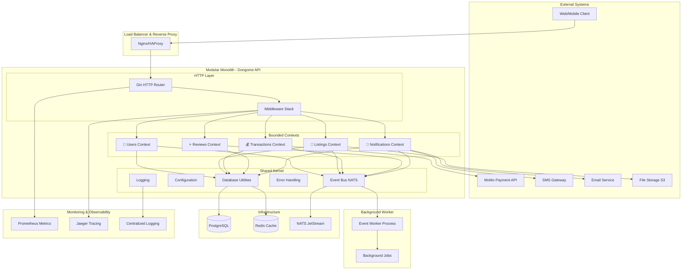
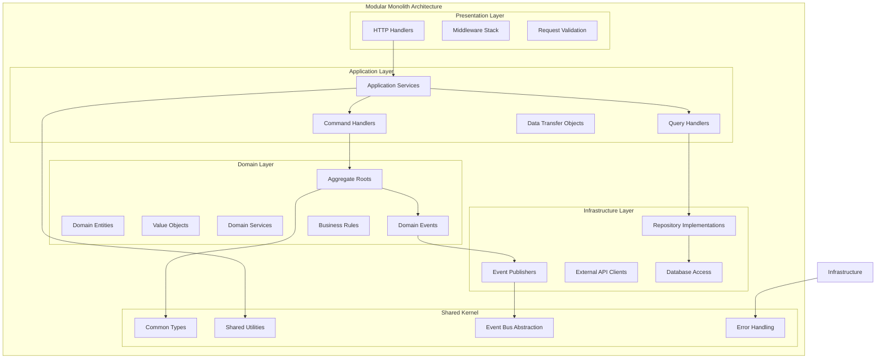
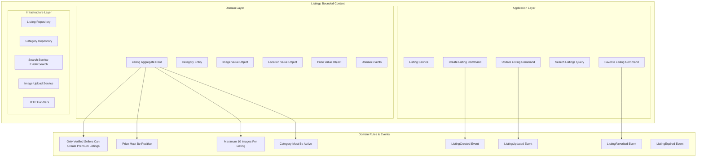
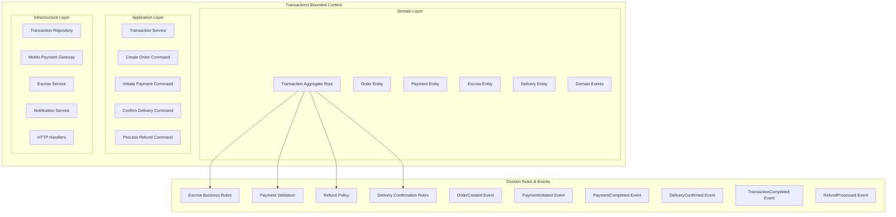
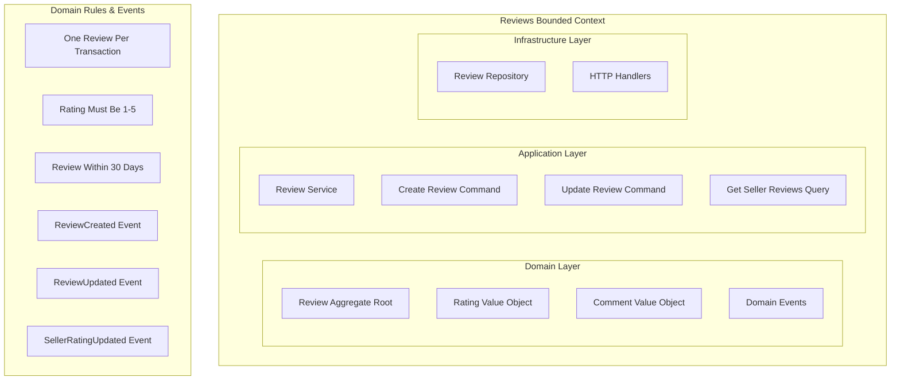
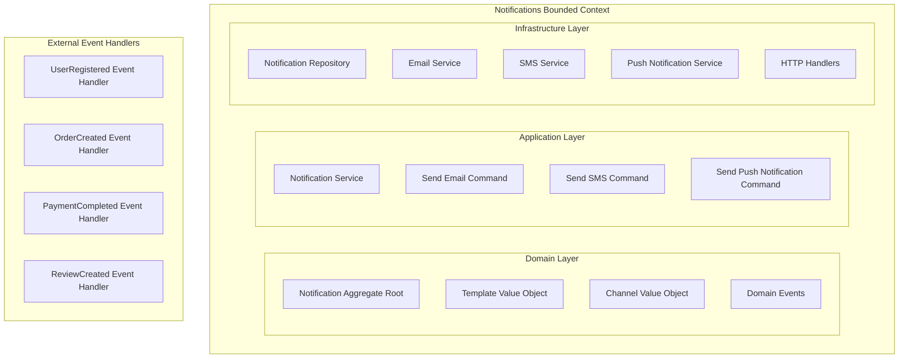
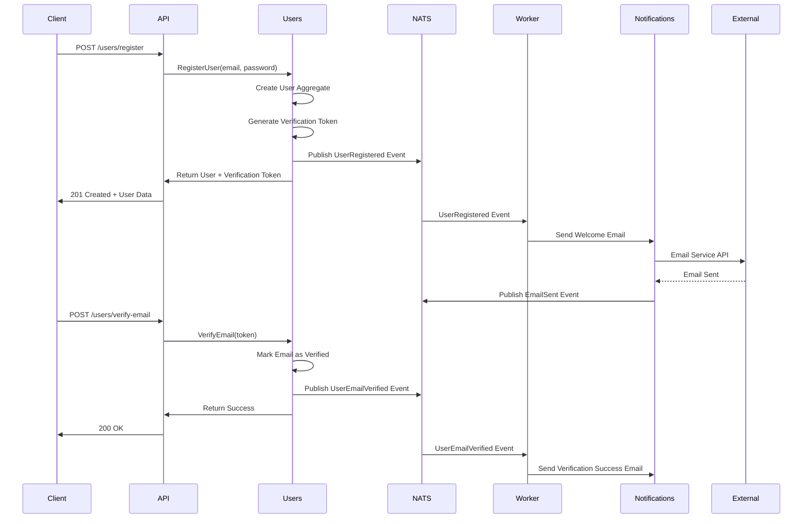
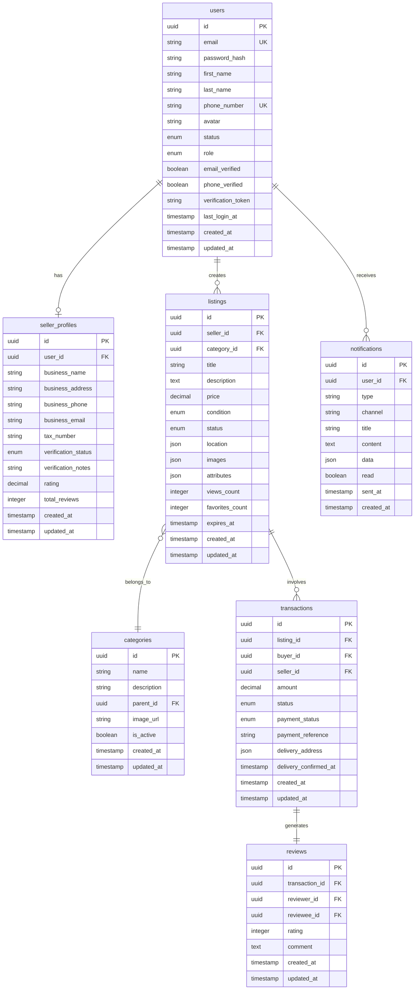
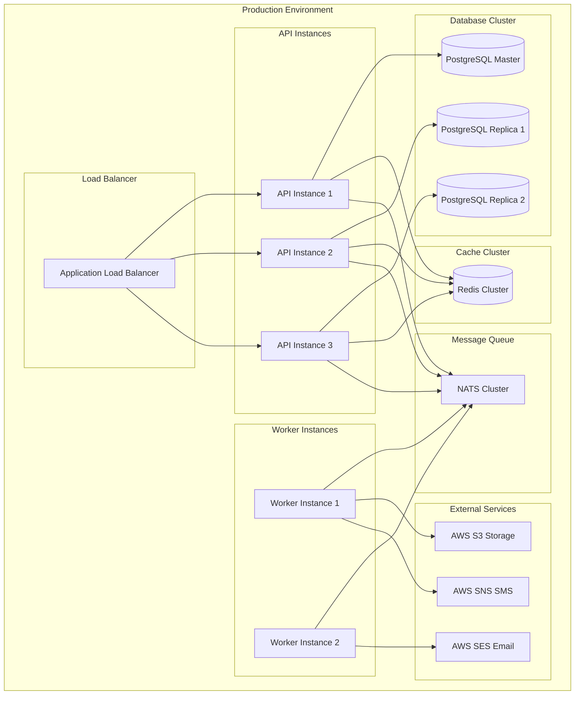

# Dongome Marketplace - Complete System Architecture

## 🏗️ High-Level Architecture Overview



## 🧩 Modular Monolith Deep Dive

### Domain-Driven Design Structure



## 📦 Bounded Context Details

### 1. Users Bounded Context

```mermaid
graph TB
    subgraph "Users Bounded Context"
        subgraph "Domain Layer"
            UserAggregate[User Aggregate Root]
            SellerProfile[Seller Profile Entity]
            UserEvents[Domain Events]
            UserRules[Business Rules]
        end

        subgraph "Application Layer"
            UserService[User Service]
            RegisterCommand[Register User Command]
            LoginCommand[Login Command]
            VerifyEmailCommand[Verify Email Command]
            UpgradeSellerCommand[Upgrade to Seller Command]
        end

        subgraph "Infrastructure Layer"
            UserRepository[User Repository GORM]
            UserHandlers[HTTP Handlers]
            UserEventPublisher[Event Publisher]
        end
    end

    subgraph "Domain Rules & Events"
        EmailUnique[Email Must Be Unique]
        PasswordPolicy[Password Policy]
        EmailVerification[Email Verification Required]
        SellerUpgrade[Seller Upgrade Process]
        
        UserRegistered[UserRegistered Event]
        UserEmailVerified[UserEmailVerified Event]
        UserUpgradedToSeller[UserUpgradedToSeller Event]
        UserLoggedIn[UserLoggedIn Event]
    end

    UserAggregate --> EmailUnique
    UserAggregate --> PasswordPolicy
    UserAggregate --> EmailVerification
    UserAggregate --> SellerUpgrade

    RegisterCommand --> UserRegistered
    VerifyEmailCommand --> UserEmailVerified
    UpgradeSellerCommand --> UserUpgradedToSeller
    LoginCommand --> UserLoggedIn

    UserService --> UserRepository
    UserService --> UserEventPublisher
    UserHandlers --> UserService
```



### 2. Listings Bounded Context



### 3. Transactions Bounded Context



### 4. Reviews Bounded Context



### 5. Notifications Bounded Context



## 🔄 Event-Driven Architecture Flow



## 🏗️ Infrastructure Components

### Database Schema Design



### Deployment Architecture



## 🔧 Configuration & Environment Management

### Environment Structure
```
config/
├── local.yaml          # Local development
├── development.yaml    # Development environment
├── staging.yaml        # Staging environment
└── production.yaml     # Production environment
```

### Configuration Layers
1. **Default Values** - Hard-coded defaults in structs
2. **Configuration Files** - YAML files per environment
3. **Environment Variables** - Runtime overrides
4. **Command Line Flags** - Deployment-time overrides

## 📊 Monitoring & Observability

### Metrics Collection
- **Application Metrics**: Request latency, throughput, error rates
- **Business Metrics**: User registrations, listing creations, transaction volumes
- **Infrastructure Metrics**: CPU, memory, disk usage, database connections

### Distributed Tracing
- **Request Tracing**: End-to-end request flow across bounded contexts
- **Event Tracing**: Asynchronous event processing flows
- **Database Query Tracing**: SQL query performance analysis

### Logging Strategy
- **Structured Logging**: JSON format with consistent fields
- **Context Propagation**: Correlation IDs across service boundaries
- **Log Levels**: DEBUG, INFO, WARN, ERROR with appropriate sampling

This comprehensive architecture demonstrates a production-ready modular monolith that can scale horizontally while maintaining clean boundaries between bounded contexts, enabling future microservices extraction if needed.