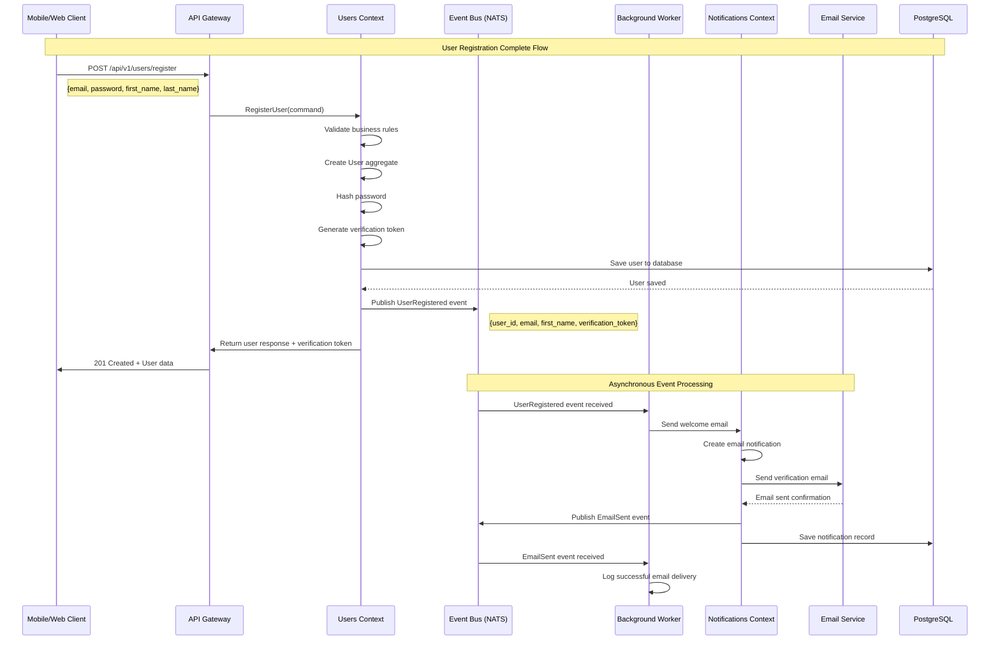
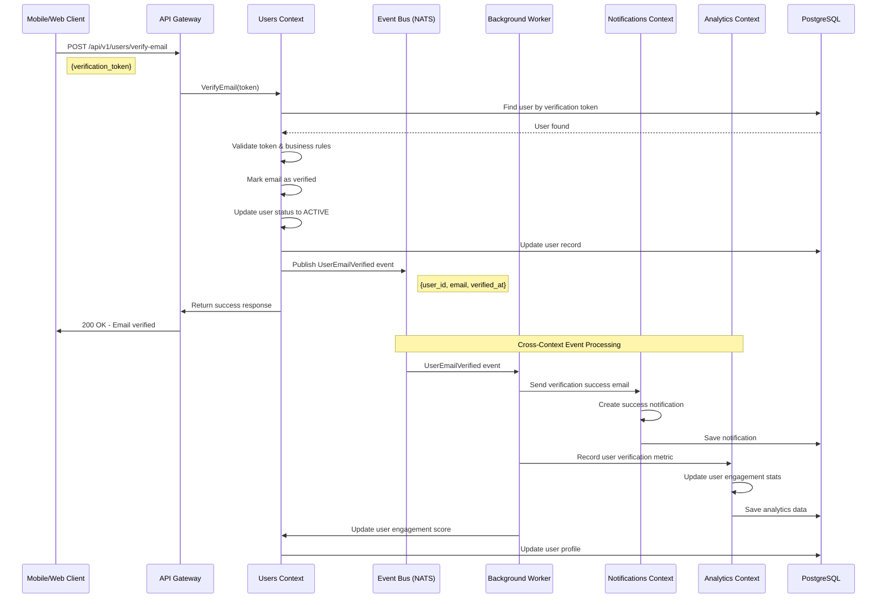
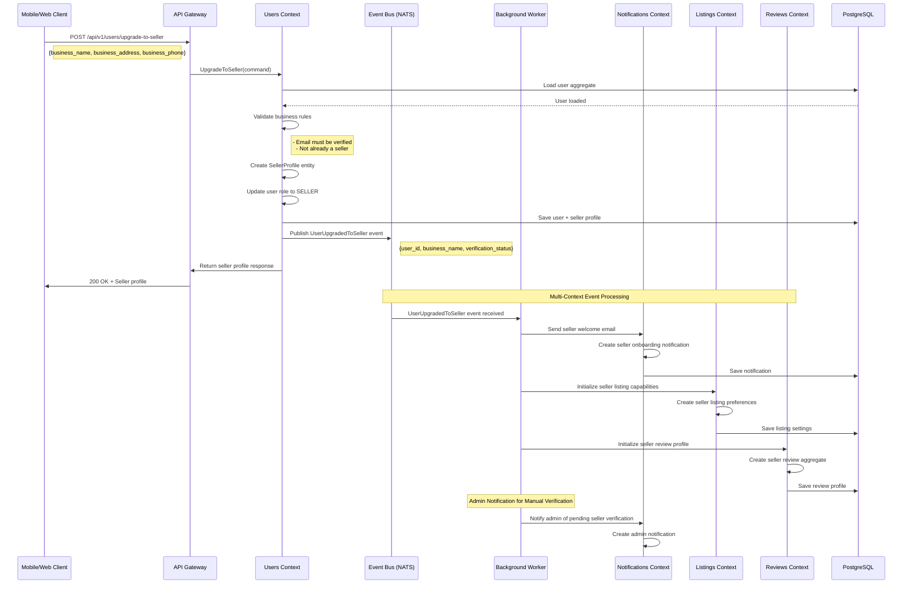
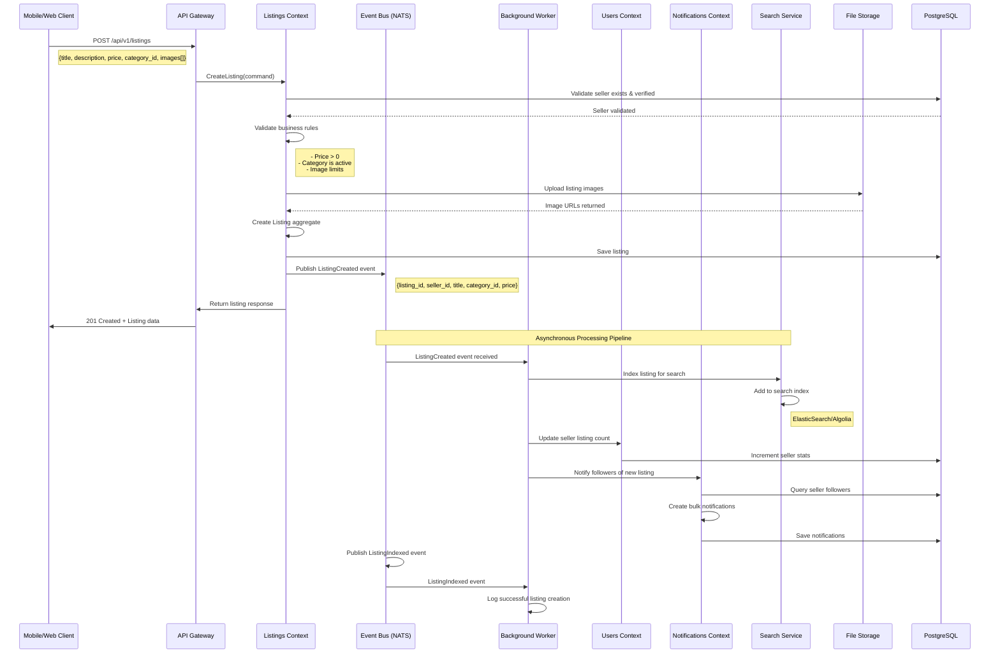
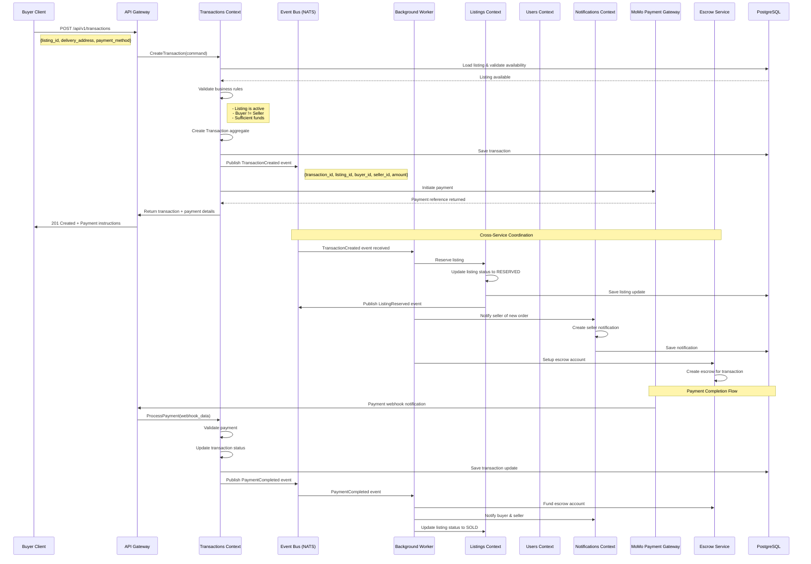
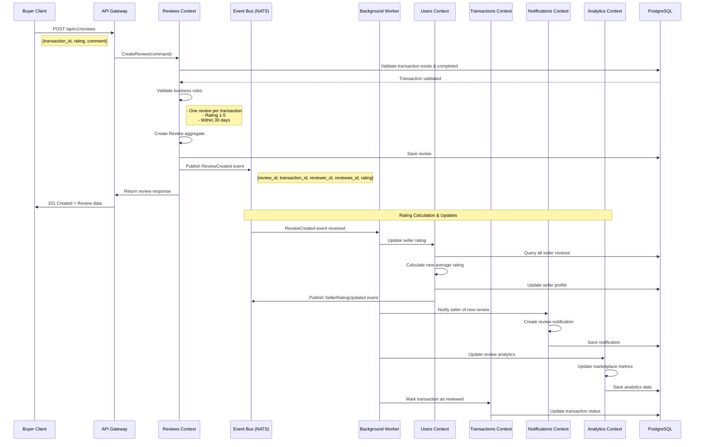
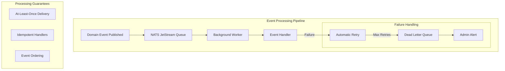

# Event Flow Documentation - Dongome Marketplace

## 🔄 Complete Event Flow Scenarios

### 1. User Registration Flow



### 2. Email Verification Flow



### 3. Seller Upgrade Flow



### 4. Listing Creation Flow



### 5. Transaction/Purchase Flow



### 6. Review Creation Flow



## 🔄 Event Processing Patterns

### Event Processing Guarantees



### Event Handler Patterns

1. **Immediate Processing**: Critical events processed synchronously
2. **Background Processing**: Non-critical events processed asynchronously
3. **Batch Processing**: Multiple events processed together for efficiency
4. **Saga Pattern**: Multi-step business processes coordinated via events

### Event Versioning Strategy

```go
// Event versioning for backward compatibility
type UserRegisteredEvent struct {
    Version   int    `json:"version"`   // Event schema version
    EventID   string `json:"event_id"`
    EventType string `json:"event_type"`
    // ... event data
}

// Handler supports multiple versions
func (h *UserEventHandler) Handle(ctx context.Context, event map[string]interface{}) error {
    version := int(event["version"].(float64))
    
    switch version {
    case 1:
        return h.handleV1(ctx, event)
    case 2:
        return h.handleV2(ctx, event)
    default:
        return fmt.Errorf("unsupported event version: %d", version)
    }
}
```

## 📊 Event Monitoring & Observability

### Event Metrics Collected

1. **Event Volume**: Events published/consumed per second
2. **Processing Latency**: Time from publish to successful processing
3. **Error Rates**: Failed event processing percentage
4. **Queue Depth**: Pending events in each queue
5. **Handler Performance**: Processing time per event handler

### Event Tracing

Each event carries correlation IDs for distributed tracing:

```json
{
  "event_id": "evt_123",
  "correlation_id": "req_456",
  "causation_id": "evt_789",
  "event_type": "UserRegistered",
  "aggregate_id": "user_abc",
  "timestamp": "2025-09-25T10:30:00Z",
  "data": { ... }
}
```

This comprehensive event flow documentation shows how the Dongome marketplace achieves loose coupling between bounded contexts while maintaining strong consistency within each context through carefully orchestrated event-driven communication.